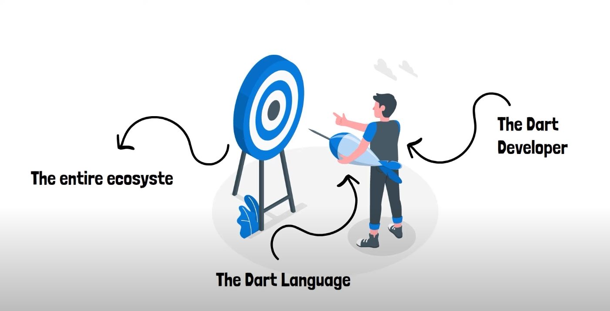
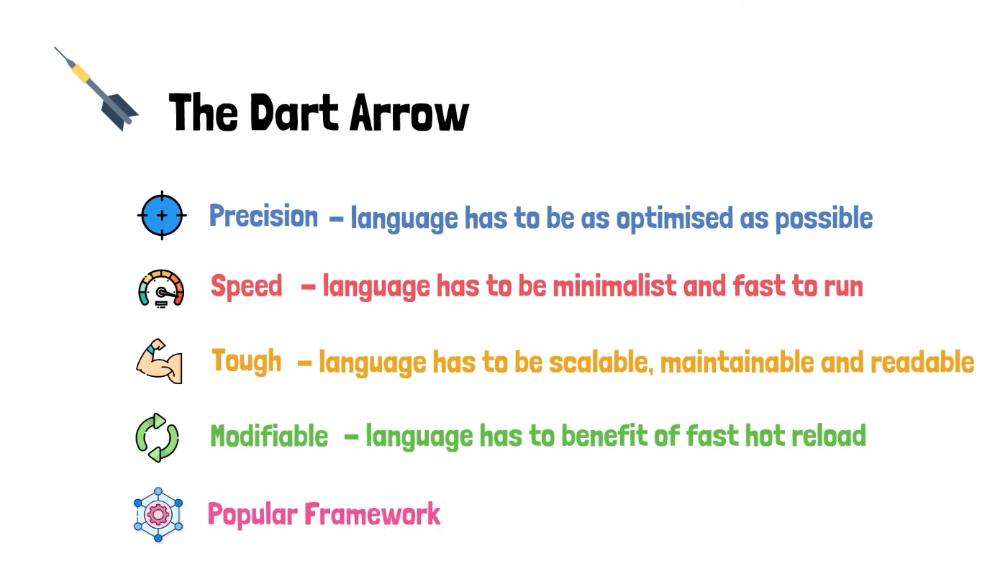
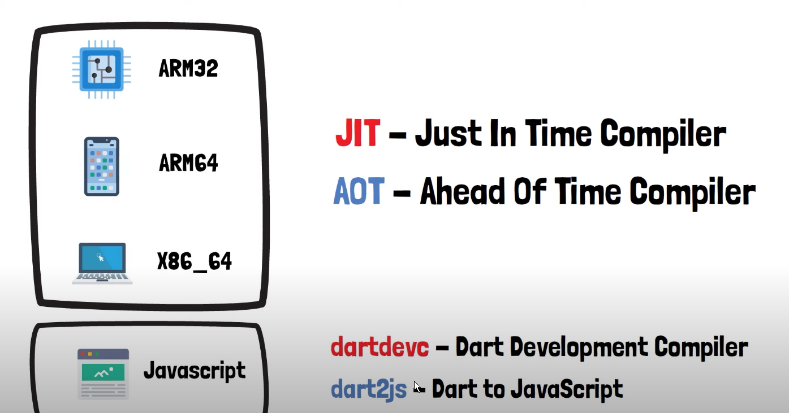

---

---

**Besonderheiten:**

* Type safe language (typisierte Sprache) -> Datentypen werden verwendet und es dürfen keine Typverletzungen auftreten. Dart überprüft Datentypen wie folgt:
  * **Static Type Check - Static Analyzer** (zur Compile Zeit) -> lässt den Code gar nicht laufen bis Fehler behoben worden ist (local check).
  * **Runtime Check** (zur Runtime überprüft) -> runtime error bzw. throws Exception (additional check).
  * Diese zwei Überprüfungen zusammen nennt man: **Sound Type System**
  * Man kann dem Analyzer (Static Type Check) explizit sagen das man den Code trotzdem ausführen möchte -> mit dem **dynamic Type**.
* Type Inference (auf Typangabe verzichten) -> Dart kann Typen ohne Angabe zuordnen mithilfe des **var** Schlüsselworts (ist kein Typ). Sobald man was zuweist, weiß der Analyzer welcher Typ es ist - ab dann kann man den Typen nicht mehr ändern. Mit dem Schlüsselwort **dynamic** schaltet man den Analyzer aus und man kann alles zuweisen, zur Runtime können auch verschiedene Typen übergeben werden, ohne Fehler.
* Sound Null Safety -> Variablen dürfen nicht **null** sein, außer man sagt das sie es dürfen. Das heißt es gibt **Nullable** oder **non-nullable** Variablen, aber eine Variable kann nie beides sein. Ist eine Variable non-nullable, beibt sie das auch über die ganze Zeit.  

---

**Dart Compilers:**

* Als Developer möchte man einen **Just in Time Compiler** (viele Vorteile, wie zum Beispiel das man nach Änderungen im Code das Ergebnis sieht ohne das Programm nochmal starten zu müssen). 
* Für die Produktion benutzt man **Ahead of Time Compiler**, weil man hier den ganzen Sourcecode in Maschinencode umschriebt und somit die App stabiler und schneller ist. 
