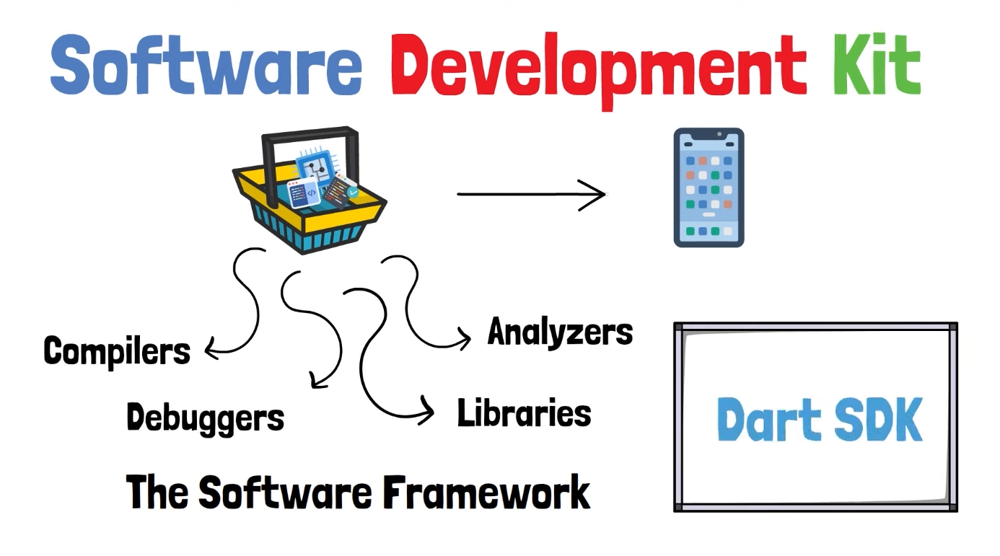
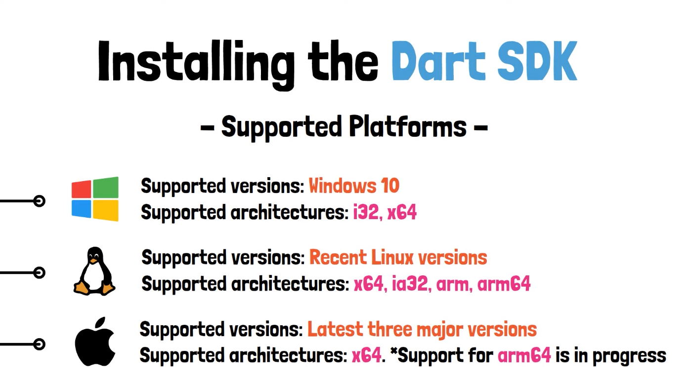

Installation von Dart SDK erlaubt das Development von:

* Command Line Apps
* Server Apps
* Non-Flutter Web-Apps
* man kann keine Flutter Apps einrichten -> dazu braucht man Flutter SDK

Man könnte auch Flutter SDK installieren, weil diese die gesamte Dart SDK braucht und mit installiert.

---

**Installing Dart SDK** 

---

**Windows mit Download von Flutter SDK:**

Instelliere die Flutter SDK - weil diese auch schon die Dart SDK beinhaltet:

* https://docs.flutter.dev/get-started/install oder folge diesem Video: https://www.youtube.com/watch?v=VFDbZk2xhO4
* Alle Steps folgen - gründlich durchlesen bzw. ansehen (suche Windows aus und Android).
* Nicht vergessen bei den Umgebungsvariablen nach zu sehen ob es auch im Path enthalten ist.

**Windows mit Package Manager [Optional]:**

* Install chocolatey: www.chocolatey.org/install und den Steps folgen.
* Nach Installation, als Admin wieder in Powershell rein.
* Package für SDK suchen: [Chocolatey Software | Packages](https://community.chocolatey.org/packages).
* Stable Version aussuchen und über Powershell installieren.
* die Umgebungsvariable ist dann auch direkt gesetzt.

**Update SDK:**

* Egal ob flutter SDK oder Dart SDK downgeloaded worden ist mit dem Schlüsselwort `flutter` oder `dart` sieht man ob ein update zur Verfügung steht.

