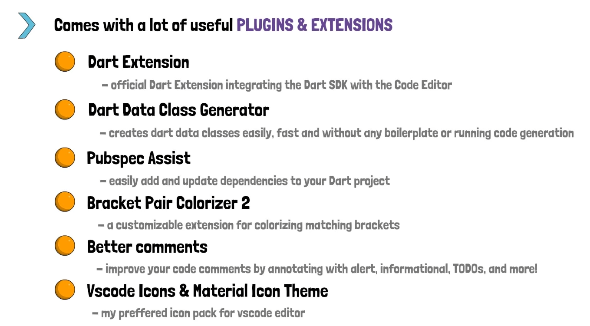
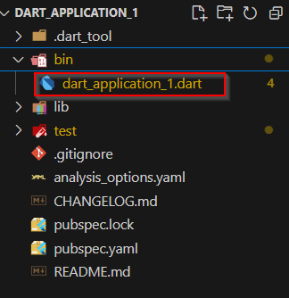

Verwendung von VSCode wird empfohlen - die wichtigsten Plugins & Extensions für VSCode:

---

**Projekt anlegen:**

* Eingabe von `dart` in CMD, Bash oder Powershell kann man alle commands sehen 
* `dart create` für das Anlegen eines Projekts - hierbei geht man am Besten mit der CMD schon in den gewünschten Ordner. 
* `dart create -t console <name des Projekts>`
* in CMD `code .` eingeben und VSCode mit dem Folder öffnet sich.

---

**Code ausführen:**

* Befindet man sich im Terminal (CMD, Bash, Powershell) schon im Projekt Ordner, so kann man einfach `dart run` ausführen.
* Dart weiß das sich das Main-File im **bin** Ordner befindet

* Ist das Main-File nicht im bin Folder, so muss man im Terminal `dart run <Pfad wo das File liegt>` angeben.

---

**Debugging:**

* In VSCode (leichter)
* Mit DevTools (advanced) -> aktivieren über CMD `dart pub global activate devtools` (https://dart.dev/tools/dart-devtools)
* `dart run --pause-isolates-on-start --observe <dart-file>` um einen Link zu Dev Tools zu bekommen. Diesen dann in einen Chrome-Browser eingeben - fertig.
* Für Flutter DevTools: https://docs.flutter.dev/tools/devtools/overview

