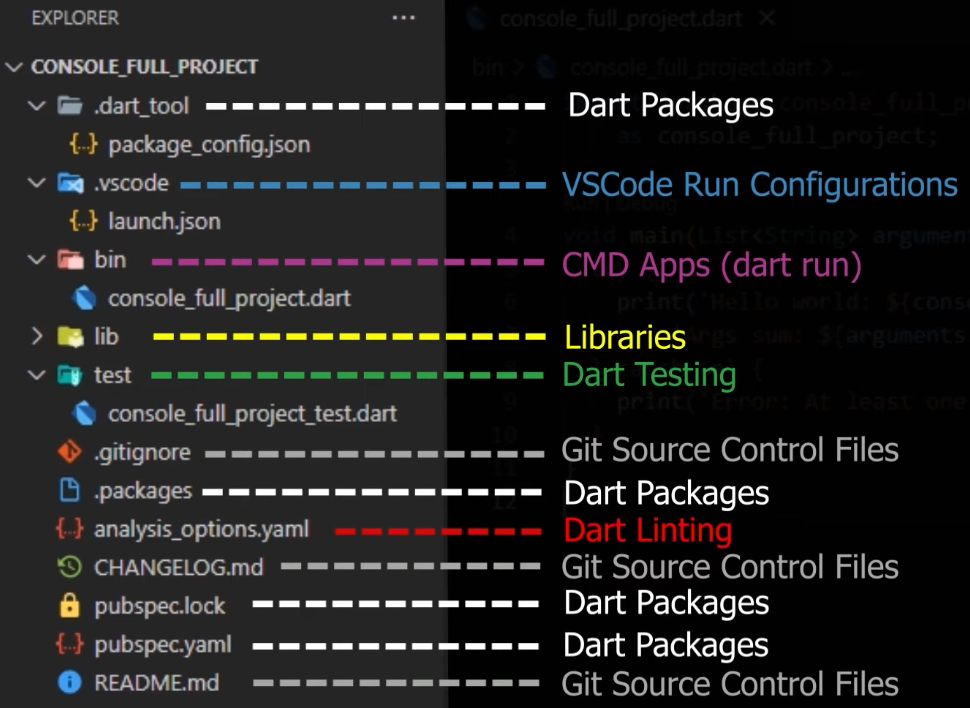

---

**Dart Packages:**

* Eigentlich gibt es keine Dart Projekte, sondern es sind alles Packages. Das "Projekt" welches erstellt worden ist, ist auch ein Package. 
* Auf www.pub.dev werden public packages hochgeladen - damit man schon vorgefertigte libariers hat (z.B Math package, serialaziable package, usw.).
* Packages die hochgeladen werden nennt man **Library Package** und eins welches nicht hochgeladen wird nennt sich **Application Package**.
* Packages können von anderen Packages abhängen und deshalb gibt es einen Package Manager -> **pub**.
* **pubspec.yaml** ist das file welches die Abhängigkeiten anzeigt. 
  * Ganz Oben wird der Name unseres Packages definiert `name:`
  * Danach auf welcher Dart-Version das Programm läuft `environment:`
  * Zum Schluss die externen Packages, von diesen hängt unser Package dann ab `dev_dependencies:`
* **package_config.json:** 
  * listet alle Abhängikeiten aller Packages auf die im pubspec.yaml aufgelistet waren. Weil zum Beispiel das Math-Package auch von anderen Packages abhängig ist. 
* **.package:**
  * ist die veraltete Version von package_config.json
* **pubspec.lock:**
  * verlinkt alle Packages mit der richtigen SDK-Version für unser Programm

---

**Dart Linting:**

* **analysis_options.yaml** ist das File welches Lint Rules setzt. Für den Static Analyzier wichtig. 

---

**Tests:**

* Unter Ordner Test zu finden. 

