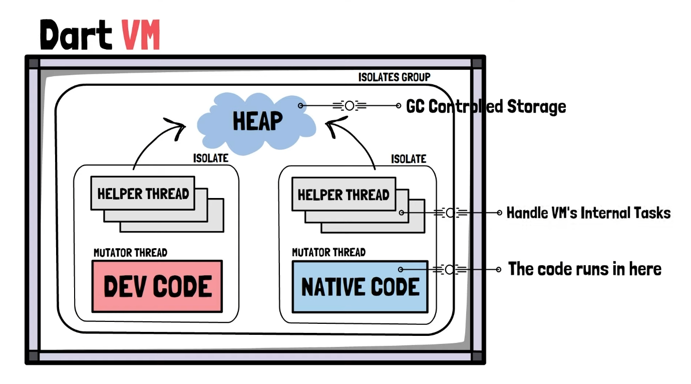
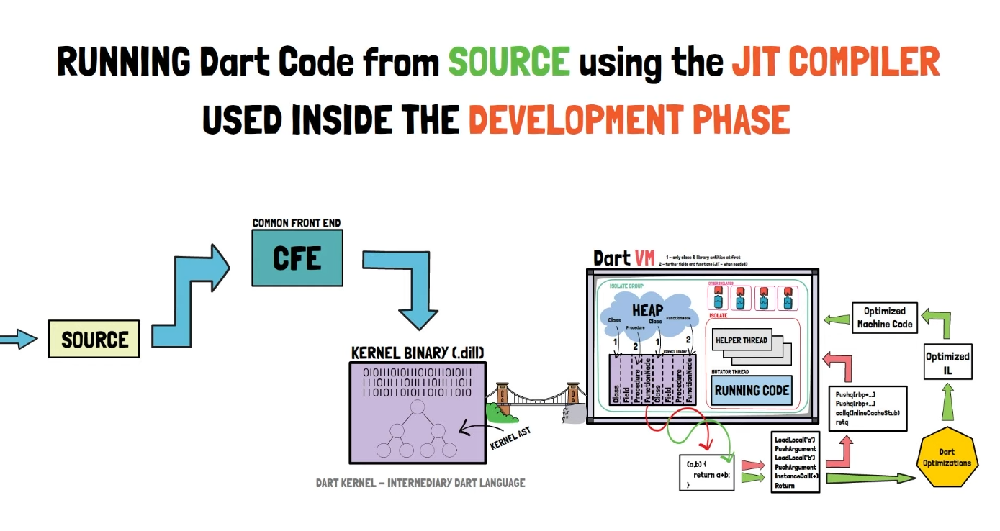

* Development Phase
  * Für Developer wichtig (Writing, running, debugging)
  * JIT - Compiler
* Production Phase
  * Für User wichtig (fast, optimized)
  * AOT - Compiler
  * Hier müssen aber auch Developer testen! Testing in real world scenarios

---

**Dart VM:**

* RUNTIME System
* Development Experience components
  * Debugging
  * Hot reload
* JIT & AOT Compilation Pipelines

---

**Wie startet Dart ein Programm?**

1. Vom Source Code mit Hilfe JIT/AOT -Compiler

   * JIT -> Dart VM erwartet Binaries, dass wird vom Dart Package `common front end` (CFE) übersetzt. Im nächsten Step wird dieses Binary an die Dart VM gesendet. Wird lazy geladen, d.h es ladet nur was es braucht zur runtime.

     

   * AOT -> sehr ähnlich, es gibt aber noch einen zwischen Schritt, dieser heißt `type flow analaysis` (TFA), welcher nach dem übersetzten vom Sourcecode geschieht. 

2. Von Snapshots (jit, aot oder kernel snapshots) 

   * ist grundsätzlich nur eine serialized Heap 

