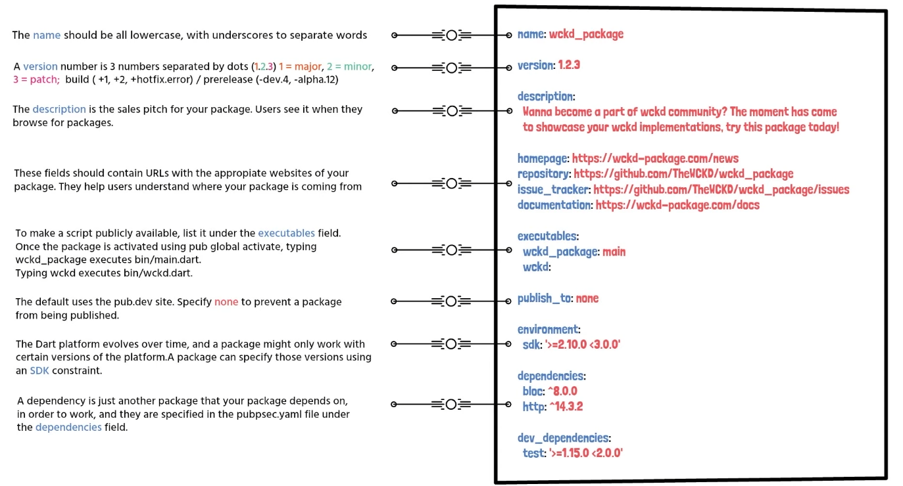
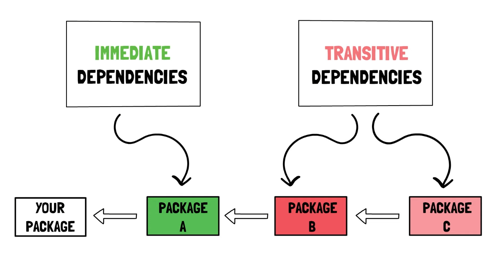
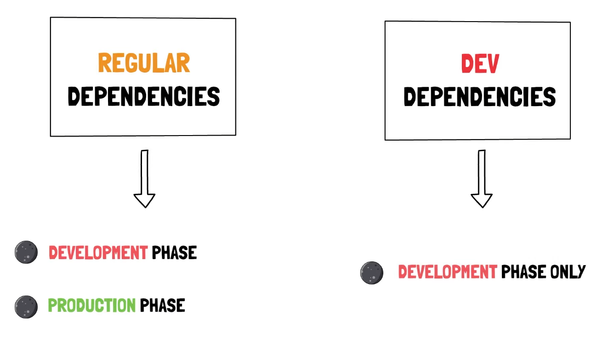
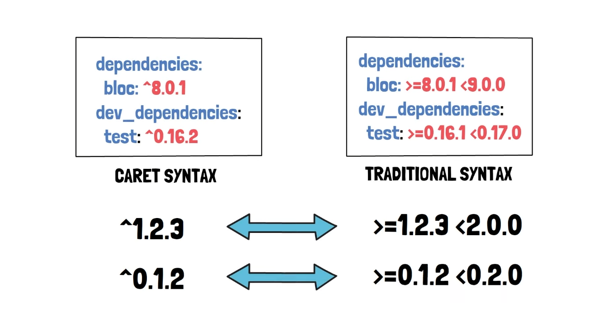

Minimum Vorraussetzung ist das **pubspec.yaml** file. 

Anleitung zum generieren eines Dart Packages:

1. Ordner erstellen 
2. Dart File erstellen - main.dart
3. pubspec.yaml File erstellen
4. Name vom Package eingeben und environment fürs SDK (min. Andorderung)
5. Im Terminal  `dart pub get` eingeben und es wird ein Package initialisiert mit neuen Files

Aufbau eines **pubspec.yaml** File:

---

Packages die direkte Abhängigkeit zu anderen Packages haben nennt man **immediate dependencies**, sollten diese wiederum Packages haben die von anderen abhängen, so nennt man diese **transitive dependencies**.

---

Die **DEV Dependencies** werden im Productive Scenario ignoriert. 

---

Syntax der Versionsnummern von Dependencies bzw. Packages (man sollte CARET Syntax benutzen): 

---

