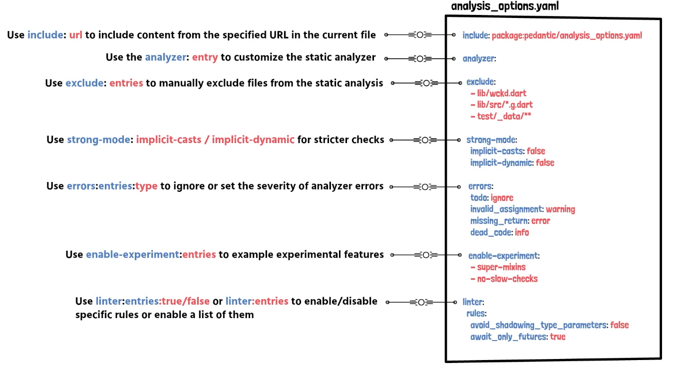

**Organized & Consistent Code:** 

* Format Code
* Function & Variable naming
* Structure Files & Directories

**Simple Code**

**Test Code**

---

**analysis_options.yaml:**

---

Struktur für ein Flutter Projekt: https://medium.com/flutter-community/flutter-code-organization-de3a4c219149
