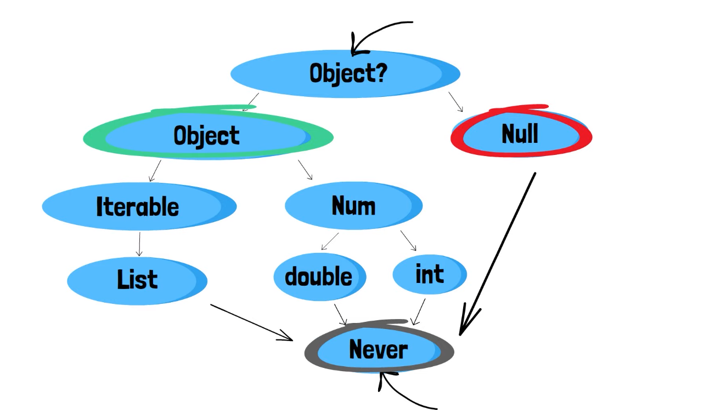

**Null Safety:** Keine null Werte wo man sie nicht erwartet - keine App Crashes.

**Sound:** Wenn Datentypen (Variablen) einen Wert haben der nicht null ist, dann kann dieser nie null werden.

---

**Null Safety:**

* Typen sind grundsätzlich non-nullable - variablen können nicht null sein, auße man sagt es explizit
* Runtime null errors werden in edit-time analysis erorrs umgewandelt - schnellste Möglichkeit einen Fehler zu finden
* Null zeigt auf das ein Wert fehlt und es ist gut das es das gibt zum überprüfen
* der Fehler ist null selbst, sondern null dort zu haben wo man es nicht erwartet
* Das Ziel von Null Safety ist es die Kontrolle zu haben wann, wie und wo null durch gehen kann im Programm
* Datentypen können mit einem ? **nullable**  gemacht werden (String?, int?, usw)
* Implizit Downcast ist nicht mehr möglich nur mit einem **as** noch machbar
* Man kann keine Base Methoden mit einem **nullable** Type ausführen, weil diese null sein könnten
* Einzigsten Methoden sind **toString(), == & hashCode** für **nullable** Types
* In Null Saftey ein Objekt von jedem Typen ist vom Typen **Object?**
* Der **Never** Type ist nun ganz unten im Hierarchie-Baum und wird für Exceptions benutzt

* Variablen müssen initialisiert werden -> das gilt natürlich nur für **non-nullable** Variablen. Auch Parameter müssen einen Wert halten, weil der Default-Wert Null ist. D.h entweder den Parameter **nullable** machen oder einen default Wert mitgeben - `void myFunction([int beta = 2])`
* Auch non-nullable Klassen-Felder müssen initialisiert werden wenn sie deklariert werden bevor der Konstruktor ausgeführt wird
* Methoden müssen richtigen Typen zurück geben -> der Analayzer schreit sofort und lässt nicht ausführen

---

**Control Flow Analysis:** 

* Erkennt viele Sachen (IF, Else-Verzweigungen mit return-Statements) und lässt so den Code durch
* Wenn der Analyzer aber einmal spinnt, aber man selbst weiß das es nicht null sein kann - gibt es die Nullassertion Operator: `!` nach der Variable setzen. Wird auch Casting away nullability.

Möglichkeiten: 

1. 
2. 
3. 

 

