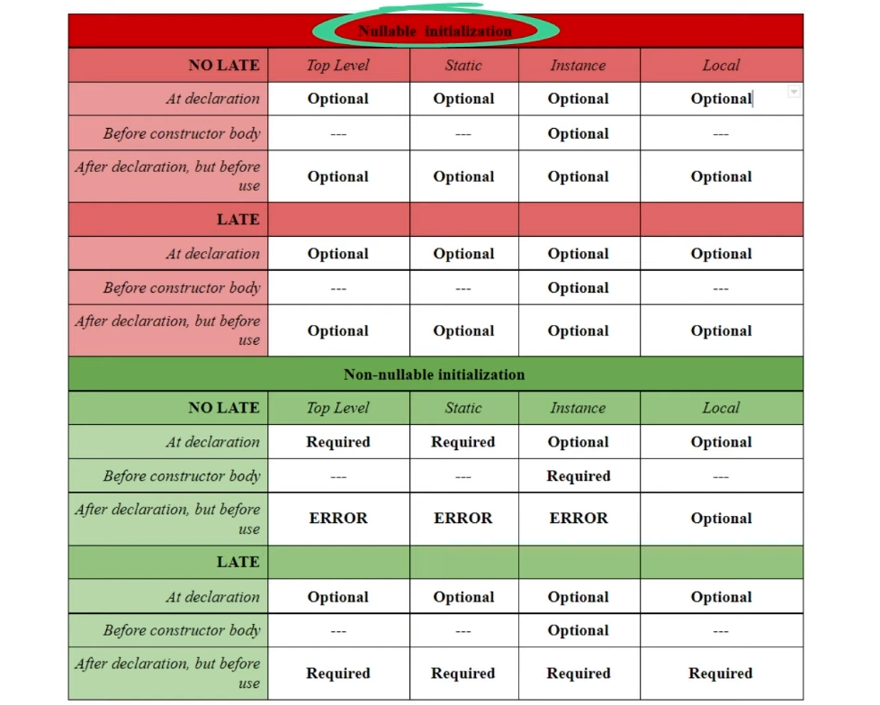
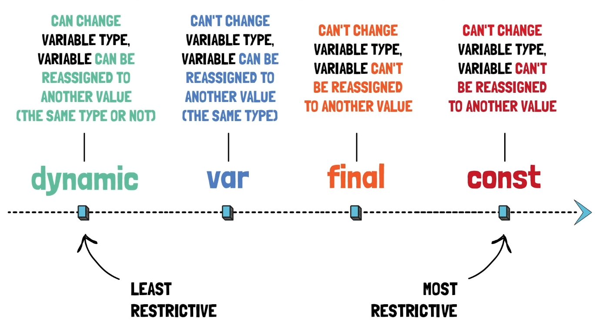

**Jede Variable ist ein Objekt** 

Tipp: beim import von libaries -> `import: 'dart:math' as math;` damit man dann die Methoden von math mit dem Wort `math.` ausführen kann.

**Keywords** (es gibt sehr viele):

* `var` - keyword wird zur compile Zeit typisiert, d.h der Typ der initialisert worden ist muss weiterhin dieser Typ bleiben (`var a = 5` -> a muss immer int bleiben)
* `dynamic` - keyword wird zur runtime typisiert und kann seinen Typ auch ständig ändern

---

**Variablen:**

es gibt **TOP-LEVEL, STATIC und LOCAL** Varaiblen. Es kommt darauf an wo man diese deklariert.

* Top Level:
  * Ganz oben im Code (globale Variable) -> im ganzen Code benutzbar
* Local:
  * lokal in einer Methode und nur in der Methode verwendbar
* Static:
  * man muss kein Objekt von der Klasse anlegen um dieses Feld aufzurufen
  * Instanz Variablen (Felder) einer Klasse

**Richtiges deklarieren einer Variable:**

* Top Level:
  * eine nullable Variable kann so deklariert werden ohne Fehler: `int? nullableTopLevel;` - kann aber auch initialisiert werden wenn man möchte oder sogar null übergeben.
  * non-nullable müssen deklariert werden mit richtigen Typen: `int nonNullableTopLevel = 5;`   . **Ausnahme:** man kann es später machen dafür aber dann `late`-Modifier verwenden: `late int nonNullableTopLevel;`
* Static: 
  * kann man nicht im Konstruktor initialisieren. Entweder direkt bei der Deklarierung oder mit dem Modifier `late`.
* Instanz:
  * non-nullable kann man im Konstruktor initialisieren: `required this.nonNullable`als Parameter oder im Konstruktor in der Initalisierungsliste. Aber nicht im Konstruktor Body.
* Lokal: 
  * non-nullable Variablen muss man hier nicht sofort deklarieren, aber sie müssen jedenfalls deklariert werden bevor sie benutzt werden.

Tabelle der richtigen Deklaration und Initialisierung:

---

Unterschied **const** - **final**:

* const: 
  * const ist nicht nur für Variablen, sondern auch für Werte! `int a = 5` -> der Wert ist const ohne es anzugeben! Diese Zeile Code entspircht: `int a = const int(value:5)` -> in diesem Fall ist aber die Variable keine const und man kann der Variable andere Werte übergeben. 
  * ist die Variable const, so kann man den Wert nicht mehr ändern -> und der Wert ist ebenso const
  * der Wert der const Variable wird zur compiletime bestimmt
  * kann nicht als Instanzvariable deklariert werden (außer mit static davor)
* final:
  * ist die Variable final, so kann man den Wert nicht mehr ändern -> der Wert ist aber nicht const bei default. Zum Beispiel bei einer final Liste, kann man Werte dazugeben oder löschen.
  * Um die Werte const zu machen muss man das explizit angeben mit `const` -> `final list = const [1,2,3];` ist das selbe wie: `const list = [1,2,3];`
  * der Wert der final Variable wird zur runtime bestimmt (können Fehler entstehen)
  * kann als Instanzvariable deklariert werden - benutzt man für Performance, indem man eine final Instanzvariable hat und den Wert const macht wird immer der gleiche Wert aus dem Speicher genommen.

