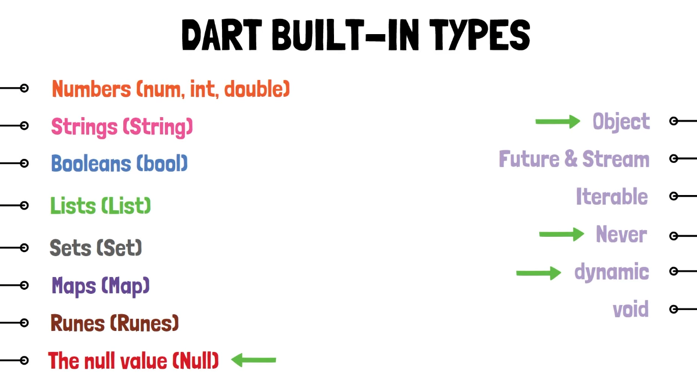
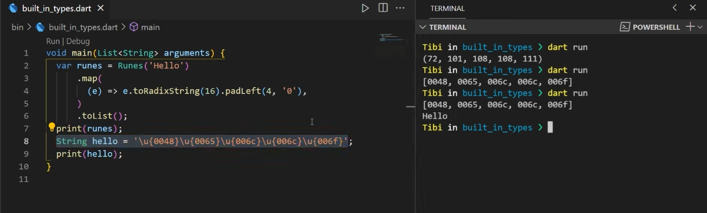

Special Support für Built-in Types wie: String, int, List, usw. Das heißt man benutzt Litarale so muss man keine Klasse aufrufen sondern kann einfach einen Wert zuweisen. Die Litarale sind const Values: `int a = 5`. Die Zahl 5 wird somit immer vom gleichen Speicher kommen und ist somit effizienter.

**Built-in Types:**

* Default Types
* Befinden sich in der Core-Library von Dart und muss nicht importiert werden

---

* Numbers:
  * `num` ist die Superklasse von `int` und `double`
  
* String: 
  * Wichtigster Built-in Type
  * `${celsius.toUpperCase()}` so kann man auch einen String ausgeben mit Statement bzw. Methoden Aufruf
  * Unicode ausgeben: `\u{1F339}` (Emojiis anzeigen)
  * Absatz: `\n`
  * Concatination: `a+b` oder `'Hallo' 'Anderer String'` -> Strings nebeneinander schreiben 
  
* Lists:
  * die meist benutzte Colletiction Klasse
  * `List<int> list = [1,2,4];`
  * Eine Liste kann alles halten -> mit `List<dynamic>` oder mit `List<Object>` oder sogar mit null Values `List<Object?>` -> Man muss aber die Werte in der Liste dann wieder zurück casten um die Methoden aufrufen zu können: `var integerValue = list[0] as int;` 
  * es gibt spread operator (nachschauen wenn es interessant wird)
  * Conditon of and Condition for innerhalb der Liste
  
* Sets:

  * Werte sind nicht geordnet
  * Initialisieren: `var set = <int>{};`, oder `var set2 = {1,2,3};` oder `Set<int> set3 = {1,2,3};`

* Maps:

  * Key - Value Pairs
  * Initialisieren: `var map = {1:2, 3:4};` oder `var map2 = Map();`

* Runes:

  * Strings sind Hexadezimalzahlen -> UTF-16 CODE UNITS

  * `Runes runes = Runes('Hello');` -> Output: `(72, 101, 108, 108, 111)` -> in dem Fall sind es keine Hexazahlen, aber man kann es natürlich so programmieren: 

    

